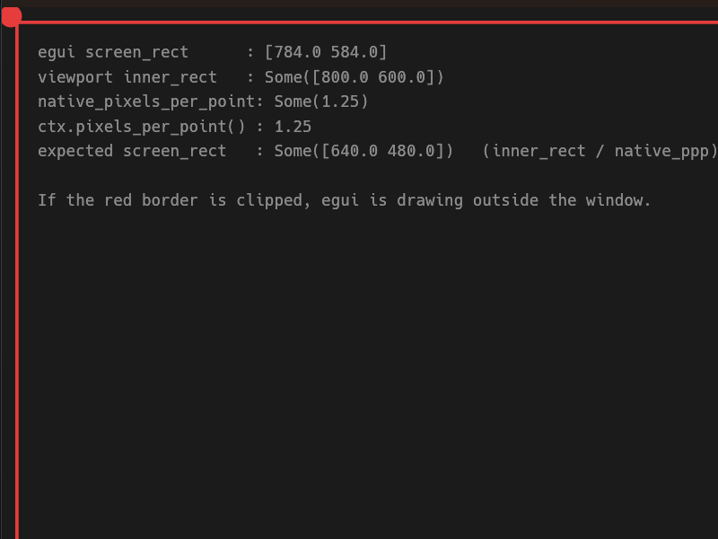

# eframe 0.35: on Windows with display scaling, `screen_rect` is the window's
# physical size treated as points, so the UI is drawn scale-factor too large

*Ready to file at <https://github.com/emilk/egui/issues>. The reproduction is in
this directory.*

---

## Summary

On Windows with display scaling above 100%, eframe gives egui a `screen_rect`
equal to the window's size **in physical pixels**, interpreted as **points**.
Because egui then renders at `pixels_per_point` = the native scale factor, the
UI is drawn scale-factor larger than the window and clipped on the right and
bottom edges.

At 125% scaling a requested `inner_size` of 800x600 produces:

| | value |
|---|---|
| OS client area (`GetClientRect`) | **800 x 600 physical px** |
| `native_pixels_per_point` | **1.25** |
| Correct logical size | **640 x 480 points** |
| `screen_rect` egui receives | **800 x 600 points** ← 1.25x too large |

Everything outside the top-left 640x480 points is drawn beyond the window.

## Reproduction

`Cargo.toml`:

```toml
[dependencies]
eframe = "0.35"
```

`main.rs` is in this directory (~90 lines, no dependencies beyond eframe). It
draws a red border inset 4 points from `ui.max_rect()` with a filled circle at
each corner, and prints the geometry each second.

**Expected:** all four corner markers and the whole border visible, and
`screen_rect == inner_rect / native_pixels_per_point`.

**Observed at 125% scaling:** only the top-left corner marker is visible; the
right and bottom edges of the border are outside the window entirely.

```
frame   30  screen_rect=[784.0 584.0]  inner_rect=Some([800.0 600.0])
            native_ppp=Some(1.25)  ppp=1.25  expected=Some([640.0 480.0])
```

(`784 x 584` is `800 x 600` less the default `CentralPanel` margin.)

`GetClientRect` on the same window returns **800 x 600 physical pixels**, so
the window is 640 x 480 points and egui was handed 800 x 600.



## Environment

- eframe / egui **0.35.0** (current stable at time of writing)
- Windows 11 (10.0.26300), single monitor, **125% scaling** (DPI 120)
- 3840 x 2160 panel
- rustc 1.97.1, `x86_64-pc-windows-msvc`
- Reproduced with **both** the `glow` and `wgpu` backends

## The relationship

Across four configurations the behaviour fits

```
screen_rect_points = physical_px * display_scale / pixels_per_point
```

so the pixels egui asks for are always `physical_px * display_scale`,
**independent of `pixels_per_point`**. That is why no scaling knob compensates.

## Already ruled out

Listed so reviewer time is not spent on them — each was measured, not assumed.

| Suspect | Result |
|---|---|
| `wgpu` instead of `glow` | byte-identical geometry |
| `ctx.set_pixels_per_point(1.0)` | `screen_rect` grows to 1600x1050; overdraw unchanged |
| `ctx.set_zoom_factor(0.8)` | `pixels_per_point` stays 1.25; inert |
| `SetProcessDpiAwarenessContext(PER_MONITOR_AWARE_V2)` before window creation | no effect |
| Application-side panel layout | `Panel::right` reserves space correctly in isolation |
| Omitting `with_inner_size` | same, using `min_inner_size` instead |

## Workaround

A **resize event reconciles the two**. After an external resize, `screen_rect`
tracks the window. Applications can request one on an early frame:

```rust
if self.frames == 2 {
    let size = ui.clip_rect().size();
    ctx.send_viewport_cmd(egui::ViewportCommand::InnerSize(size));
}
```

This recovers most of the discrepancy; resizing the window manually clears the
rest.

## Possibly related

- #4960 — Wayland, window twice the intended size at scale 2.0
- #5462 — Wayland, viewport loads at 2x `inner_size_points`
- #4918 — Windows, wrong window place and size across displays with different DPI

Those describe the *window* coming out the wrong size, on Wayland or across
multiple monitors. This is a single monitor on Windows where the window is the
size that was asked for, and the *content* is drawn past its edges.
